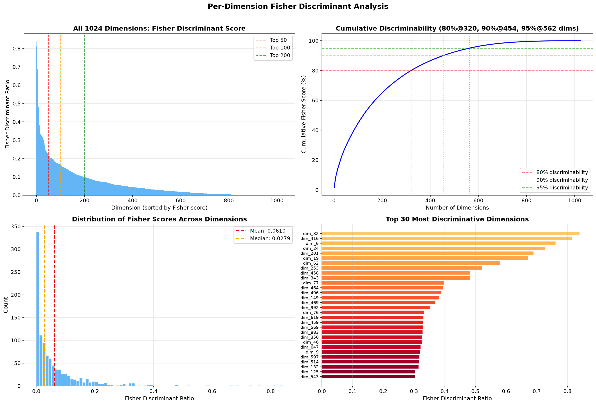
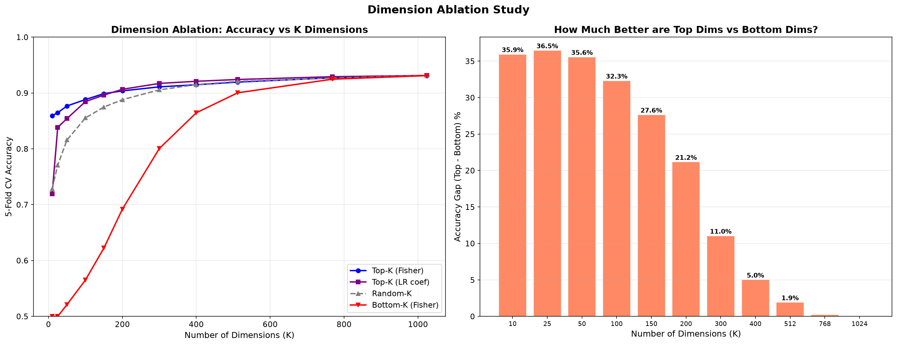
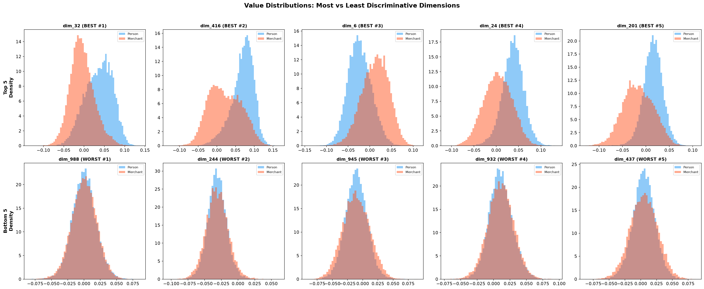
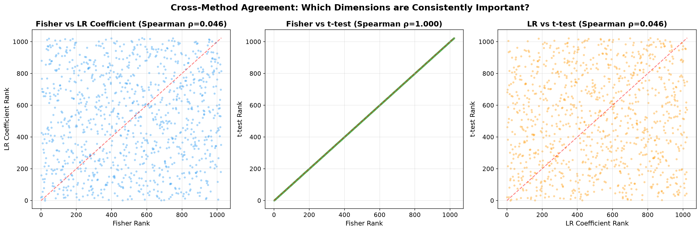

# Stage 4: Dimension Importance Analysis — Which Embeddings Help?

**Date:** 2026-06-22 04:20
**Status:** Complete

---

## Setup
- **1024 dimensions** analyzed with 3 independent methods
- **50K stratified sample** from 233K dataset
- **6 analyses**: Fisher discriminant, t-test, LR coefficients, ablation, distributions, cross-method agreement

---

## 1. Per-Dimension Fisher Discriminant

**Key Finding**: Discriminative power follows a **power law** — a few dimensions are very important, most are weak but nonzero. The top 5 dims (32, 416, 6, 24, 201) have Fisher scores 0.69–0.84, while the median is just 0.028.

| Threshold | Dimensions Needed |
|:---|---:|
| 80% discriminability | **320** dims |
| 90% discriminability | **454** dims |
| 95% discriminability | **562** dims |

---

## 2. Dimension Ablation Study

### The Most Important Chart — Accuracy by Dimension Count

| K dims | Top-K (Fisher) | Bottom-K (Fisher) | Gap |
|---:|---:|---:|---:|
| 10 | **85.9%** | 50.0% (chance!) | 35.9% |
| 50 | **87.7%** | 52.1% | 35.6% |
| 100 | **88.8%** | 56.5% | 32.3% |
| 200 | **90.4%** | 69.2% | 21.2% |
| 512 | **92.0%** | 90.0% | 1.9% |
| 1024 | **93.1%** | 93.1% | 0.0% |

> **Just 10 dimensions get you 85.9% accuracy!** But you need ALL 1024 for the full 93.1%. The long tail of weak dimensions collectively adds ~5% accuracy — each individually weak but together essential.

> **Bottom 50 dims = 52.1% (random chance)** — these dimensions carry ZERO classification signal. They encode other semantic information (syntax, grammar, etc.)

---

## 3. Top vs Bottom Dimension Distributions

**Key Finding**: The best dimensions (top row) show clearly separated Person/Merchant distributions with different means. The worst dimensions (bottom row) have completely overlapping distributions — they encode information that's identical for both classes.

---

## 4. Cross-Method Agreement

| Method Pair | Spearman rho | Interpretation |
|:---|---:|:---|
| Fisher vs t-test | **1.000** | Perfect agreement (mathematically related) |
| Fisher vs LR coef | **0.046** | Near-zero! LR finds different patterns |
| LR vs t-test | **0.046** | Same — LR disagrees with univariate methods |

> **Fisher/t-test and LR completely disagree on which dimensions matter!** This is actually expected and important:
> - Fisher/t-test rank dimensions **independently** (univariate)
> - LR uses dimensions **together** (multivariate) — it finds interaction effects and suppressor variables
> - Only **4 dimensions** are top-50 in ALL three methods: **dim_32, dim_46, dim_62, dim_350**

---

## Statistical Significance

| Result | Count |
|:---|---:|
| Significant dims (Bonferroni alpha=0.05) | **938** / 1024 |
| Non-significant dims | **86** / 1024 |

91.6% of dimensions carry statistically significant signal, but ~86 dimensions are pure noise for this task.

---

## Figures

| # | Figure | Description |
|:---|:---|:---|
| 10 | `10_fisher_per_dimension.png` | Per-dimension Fisher discriminant scores |
| 11 | `11_ttest_per_dimension.png` | Per-dimension t-test significance |
| 12 | `12_lr_coefficients.png` | Logistic Regression coefficient weights |
| 13 | `13_dimension_ablation.png` | Top-K vs Bottom-K vs Random-K accuracy |
| 14 | `14_dimension_distributions.png` | Value distributions of best vs worst dims |
| 15 | `15_method_agreement.png` | Cross-method ranking agreement |

---

## Implications for the Classifier

1. **Use all 1024 dimensions** for production — the long tail collectively adds 5% accuracy
2. **If latency matters**, top 200 Fisher dims give 90.4% accuracy (5x smaller input)
3. **LR finds non-obvious patterns** that univariate analysis misses — confirming that a trained classifier is necessary (not just thresholding)
4. **86 noise dimensions** could potentially be pruned, but the gain is negligible
5. **Top 10 dims alone** for a fast heuristic: 85.9% accuracy with just 10 floats

## Next Steps

- [ ] Train production classifier (Logistic Regression / MLP)
- [ ] Evaluate on held-out test set
- [ ] Test edge cases and hard examples
- [ ] Package for inference
