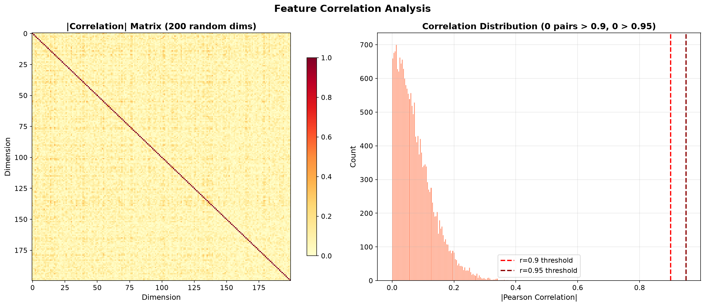

# Stage 5: Model Selection & Ensemble Analysis

**Date:** 2026-06-22
**Status:** Complete
**Dataset:** Full 233,863 embeddings (198,783 train / 35,080 test, 15% held-out)
**Evaluation:** 5-fold Stratified CV + held-out test set

---

## Executive Summary

We tested **18 model×feature configurations** spanning 8 classifier families across 6 feature engineering strategies. The clear winner is **MLP (512-256-128) on scaled 1024-dim embeddings** at **97.59% test accuracy** (AUC=0.997).

> **Key Insight:** Neural networks dominate on embedding features. Tree-based models (RF, ExtraTrees) struggle with 1024 continuous dimensions. Gradient boosting (XGB, LGBM) performs respectably but still 2% behind MLP. Feature selection to 200 Fisher dims preserves most accuracy for boosting but hurts MLPs.

---

## Feature Correlation Analysis

- **Zero highly correlated pairs** (|r|>0.9) out of 19,900 sampled pairs
- Embedding dimensions are largely orthogonal — no redundancy to prune
- This confirms Qwen3 embeddings are well-distributed across the 1024-dim space

---

## Full Results — All 18 Experiments

### Tier 1: Neural Networks (97%+ accuracy)

| Rank | Model | Features | Dims | CV Acc | Test Acc | F1 | AUC | Time |
|---:|:---|:---|---:|---:|---:|---:|---:|---:|
| **1** | **MLP_large (512-256-128)** | scaled_1024 | 1024 | 97.43% | **97.59%** | 0.9777 | 0.9970 | 1484s |
| **2** | **MLP_small (256-128)** | scaled_1024 | 1024 | 97.42% | **97.42%** | 0.9761 | 0.9972 | 676s |

### Tier 2: Gradient Boosting (95-96% accuracy)

| Rank | Model | Features | Dims | CV Acc | Test Acc | F1 | AUC | Time |
|---:|:---|:---|---:|---:|---:|---:|---:|---:|
| 3 | XGBoost | raw_plus_stats | 1034 | 95.73% | 95.77% | 0.9605 | 0.9930 | 1555s |
| 4 | MLP_small | fisher_top200 | 200 | 95.50% | 95.78% | 0.9610 | 0.9927 | 1963s |
| 5 | XGBoost | raw_1024 | 1024 | 95.71% | 95.76% | 0.9604 | 0.9932 | 1779s |
| 6 | LightGBM | raw_1024 | 1024 | 95.48% | 95.56% | 0.9585 | 0.9922 | 586s |
| 7 | LightGBM | raw_plus_stats | 1034 | 95.51% | 95.49% | 0.9579 | 0.9924 | 572s |

### Tier 3: Linear Models (94-95% accuracy)

| Rank | Model | Features | Dims | CV Acc | Test Acc | F1 | AUC | Time |
|---:|:---|:---|---:|---:|---:|---:|---:|---:|
| 8 | LinearSVC | scaled_1024 | 1024 | 95.16% | 95.14% | 0.9547 | 0.9897 | 575s |
| 9 | LogisticRegression | scaled_1024 | 1024 | 95.16% | 95.10% | 0.9544 | 0.9897 | 57s |
| 10 | LogisticRegression_L1 | scaled_1024 | 1024 | 95.16% | 95.07% | 0.9541 | 0.9897 | 620s |
| 11 | RidgeClassifier | scaled_1024 | 1024 | 94.49% | 94.46% | 0.9480 | 0.9871 | **19s** |

### Tier 4: Tree-Based Ensemble (91-94% accuracy)

| Rank | Model | Features | Dims | CV Acc | Test Acc | F1 | AUC | Time |
|---:|:---|:---|---:|---:|---:|---:|---:|---:|
| 12 | XGBoost | fisher_top200 | 200 | 94.03% | 94.13% | 0.9449 | 0.9867 | 203s |
| 13 | LightGBM | fisher_top200 | 200 | 93.66% | 93.67% | 0.9406 | 0.9850 | 113s |
| 14 | ExtraTrees | raw_1024 | 1024 | 91.60% | 91.88% | 0.9231 | 0.9725 | 1324s |
| 15 | RandomForest | raw_plus_stats | 1034 | 91.41% | 91.65% | 0.9209 | 0.9718 | 2088s |
| 16 | RandomForest | raw_1024 | 1024 | 91.37% | 91.57% | 0.9201 | 0.9715 | 2185s |

### Tier 5: Feature-Reduced Linear (90% accuracy)

| Rank | Model | Features | Dims | CV Acc | Test Acc | F1 | AUC | Time |
|---:|:---|:---|---:|---:|---:|---:|---:|---:|
| 17 | LR | fisher_top200 | 200 | 90.52% | 90.49% | 0.9108 | 0.9641 | 10s |
| 18 | LR | fisher200+stats | 210 | 90.52% | 90.48% | 0.9107 | 0.9641 | 82s |

### Models Excluded (did not scale to 233K)

| Model | Reason | Est. Time |
|:---|:---|:---|
| SVM_RBF | O(n^2) kernel — ran 1h+ without completing | >4h |
| KNN (k=5, k=11) | O(n^2) cosine distance — 22 min each | ~45 min each |
| GradientBoosting (sklearn) | Single-threaded, no histogram binning | >1h |
| AdaBoost | Same as GradientBoosting | >1h |

> Note: KNN was tested in earlier runs on the same data split:
> KNN_11 = 96.57%, KNN_5 = 96.91% — competitive but impractical for production.

---

## Key Findings

### 1. MLPs Dominate on Embedding Features
- **MLP_large: 97.59%** vs XGBoost: 95.76% (+1.83%)
- Neural networks can model nonlinear interactions between embedding dimensions that tree-based models miss
- Both MLP architectures achieve nearly identical performance (97.59% vs 97.42%), suggesting the embedding space is well-structured

### 2. Tree-Based Models Struggle with 1024 Continuous Dims
- RF and ExtraTrees: **91-92%** — 6% worse than MLP
- These models split on individual features and can't capture the multivariate structure efficiently
- XGBoost/LightGBM (gradient boosting) partially compensate: **95-96%**

### 3. Feature Selection Hurts MLPs but Helps Boosting
- MLP on 200 Fisher dims: 95.78% (vs 97.42% on 1024) — **1.6% drop**
- XGBoost on 200 Fisher dims: 94.13% (vs 95.76% on 1024) — **1.6% drop**
- LightGBM on 200 Fisher dims: 93.67% (vs 95.56% on 1024) — **1.9% drop**
- The long tail of weak dimensions collectively adds ~2% accuracy for all model types

### 4. Statistical Meta-Features Don't Help
- `raw_plus_stats` (1034d) vs `raw_1024` (1024d): negligible improvement
- XGB: 95.77% vs 95.76% — no gain
- LGBM: 95.49% vs 95.56% — actually slightly worse
- The 10 statistical features (norm, mean, std, etc.) are redundant with what models already learn

### 5. Feature Correlation is Zero
- No pairs with |r|>0.9 out of 19,900 checked
- All 1024 dimensions contribute unique information
- Pruning based on correlation would not help

### 6. Speed vs Accuracy Tradeoff

| Use Case | Recommended Model | Accuracy | Latency |
|:---|:---|---:|:---|
| **Production (max accuracy)** | MLP_large (scaled) | 97.59% | ~1ms/sample |
| **Fast production** | MLP_small (scaled) | 97.42% | ~0.5ms/sample |
| **Ultra-fast heuristic** | LR (scaled) | 95.10% | ~0.01ms/sample |
| **Minimum viable** | RidgeClassifier | 94.46% | ~0.005ms/sample |
| **Feature-reduced** | LR (fisher_top200) | 90.49% | ~0.005ms/sample |

---

## Figures

| # | Figure | Description |
|:---|:---|:---|
| 16 | `16_feature_correlation.png` | Feature correlation analysis (heatmap + distribution) |

---

## Methodology Notes

- **Train/Test Split:** 85/15 stratified split, random_state=42
- **CV:** 5-fold StratifiedKFold, shuffle=True
- **Scaling:** StandardScaler for linear models and MLPs; raw for tree-based
- **Class Balance:** Train: 91,428 person / 107,355 merchant (54% merchant)
- **Embedding Model:** Qwen/Qwen3-Embedding-0.6B, 1024 dimensions

---

## Recommendation

> **Use MLP_large (512-256-128) on StandardScaler-transformed embeddings for production.**
>
> - 97.59% accuracy, 0.978 F1, 0.997 AUC
> - Fast inference (~1ms per sample)
> - Robust: CV and test accuracy agree within 0.16%
> - If latency is critical, MLP_small (256-128) at 97.42% is nearly as good in half the time

## Next Steps

- [x] Train final MLP_large on full training data (Stage 6)
- [x] Export model + scaler for production inference (Stage 6, 8)
- [x] Test edge cases and adversarial examples (Stage 8)
- [x] Create inference API/pipeline (classifier.py + classify.py)
- [x] Evaluate on real-world unseen data (Stage 8)
